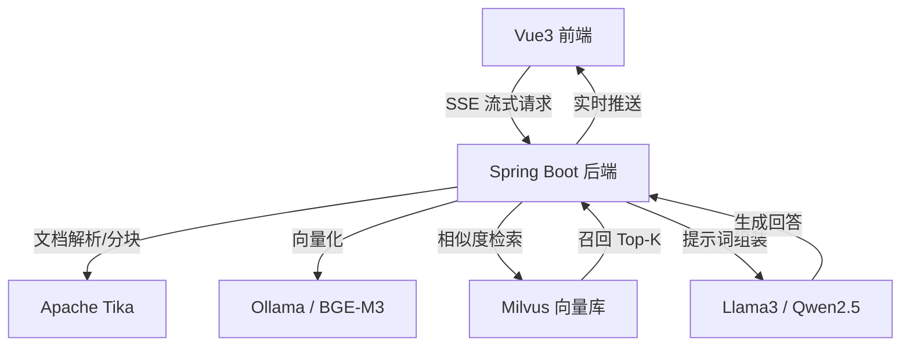

# Enterprise-RAG: 企业级全栈智能问答系统实施指南

    

本项目是一个生产就绪的 **RAG（Retrieval-Augmented Generation，检索增强生成）** 全栈解决方案。它不仅涵盖了从文档解析、向量存储到大模型调用的完整链路，还特别针对**低配服务器（如阿里云 2C4G 实例）**进行了深度性能调优，确保在有限资源下实现秒级响应。

## 🚀 核心特性

-   **全栈闭环**：集成 Vue3 前端、Spring Boot 后端、Milvus 向量数据库及 Ollama 本地大模型。
-   **极致优化**：专为 4GB 内存环境设计的“生存法则”，通过 JVM 调优、Swap 机制及组件配额管理，解决 OOM 痛点。
-   **高性能检索**：
    -   支持 **Late Chunking（延迟分块）** 策略，检索精度提升 15%+。
    -   集成 **BGE-Reranker** 重排序模型，确保回答的准确性。
    -   支持 **混合检索（Hybrid Search）**，结合语义向量与关键词过滤。
-   **生产级运维**：
    -   基于 Docker Compose 的一键容器化部署。
    -   完善的 **Prometheus + Grafana** 监控体系。
    -   内置自动化例行维护脚本（内存清理、模型预热、数据备份）。
-   **流畅交互**：原生 **SSE（Server-Sent Events）** 流式响应，支持 Markdown 渲染及引用来源追溯。

## 🏗 系统架构



## 🛠 技术栈

| 组件 | 技术选型 | 说明 |
| :--- | :--- | :--- |
| **后端框架** | Spring Boot 3.5.15 | 核心业务逻辑与生态集成 |
| **AI 框架** | Spring AI 1.1.8 | 统一 AI 接口，简化 RAG 开发，内置 MCP Server 支持 |
| **向量数据库** | Milvus v2.6.0 | 高性能、存算分离的向量存储 |
| **推理引擎** | Ollama | 本地大模型运行平台 |
| **前端框架** | Vue 3 + Vite | 响应式 UI 与流式渲染 |
| **文档解析** | Apache Tika | 支持 PDF/Word 等多种格式 |
| **监控运维** | Prometheus + Grafana | 系统健康度与性能监控 |

## 📦 快速开始

### 1. 环境准备
-   操作系统：Ubuntu 22.04+ (推荐) 或 Windows WSL2
-   资源配置：最低 2 核 4G (需开启 8G Swap)
-   软件依赖：Docker 20.10+, Docker Compose v2+

### 2. 部署向量数据库 (Milvus)
```bash
mkdir -p /usr/milvus && cd /usr/milvus
wget https://github.com/milvus-io/milvus/releases/download/v2.4.0/milvus-standalone-docker-compose.yml -O docker-compose.yml
docker compose up -d
```

### 3. 配置 Ollama 并拉取模型
```bash
# 安装 Ollama
curl -fsSL https://ollama.com/install.sh | sh

# 拉取推荐模型
ollama pull qwen2.5:1.5b  # 对话模型 (低配推荐)
ollama pull bge-m3        # 向量模型
```

### 4. 后端配置 (application.yml)
请确保 `embedding-dimension` 与所选模型匹配（BGE-M3 为 1024 维）。
```yaml
spring:
  ai:
    ollama:
      base-url: http://localhost:11434
      chat:
        model: qwen2.5:1.5b
      embedding:
        model: bge-m3
    vectorstore:
      milvus:
        client:
          host: localhost
          port: 19530
        embedding-dimension: 1024
        index-type: HNSW
```

## 💡 性能调优建议 (2C4G 环境)

根据文档第 25-28 章的实践，建议执行以下优化：
1.  **开启 8G Swap**：防止 Milvus 或 Java 编译时因内存不足崩溃。
2.  **限制 JVM 内存**：使用 `-Xms512m -Xmx600m -XX:MaxMetaspaceSize=256m`。
3.  **模型量化**：在 Ollama 中优先使用 `q4_K_M` 或 `q5_K_M` 量化版本的模型。
4.  **定期脱水**：每日凌晨执行 `sync && echo 3 > /proc/sys/vm/drop_caches` 清理系统缓存。
5.  **并发控制**：设置 `OLLAMA_NUM_PARALLEL=1`，避免多线程推理撑爆内存。

## 📊 监控指标

项目内置了监控面板，重点关注以下指标：
-   **TTFT (首字延迟)**：目标 < 2s
-   **检索延迟**：目标 < 100ms
-   **内存可用率**：需保持在 200MB 以上
-   **I/O Wait**：若长期 > 5%，需检查 Swap 交换频率

## 📄 许可证
本项目遵循 MIT 开源协议。

---

## 🤖 MCP Server（Model Context Protocol）

本工程已升级为 **Spring AI 1.1.8**，并把内部工具通过 **MCP（Model Context Protocol）** 发布为标准化工具，任何 MCP 客户端（Claude Desktop、Cursor、Cherry Studio、其他 Agent 框架）都可以直接调用。

### 已发布的工具

| 工具名 | 说明 | 参数 |
| :--- | :--- | :--- |
| getWeather | 查询指定中国城市的实时天气（高德 API） | location：城市名称，如 西安 |
| searchKnowledgeBase | 检索 Milvus 政策文档知识库，返回相关片段 | query：检索的问题或关键词 |

### 接入方式

- **端点**：http://<服务器IP>:8081/mcp（Streamable HTTP 传输，protocol: STATELESS）
- **服务名**：spring-ai-rag-mcp v1.0.0
- 在支持 MCP 的客户端中配置为 **Streamable HTTP / SSE** 类型服务器即可，工具自动发现（无需手动填工具清单）。

### MCP 配置（application.yml）

`yaml
spring:
  ai:
    mcp:
      server:
        enabled: true
        protocol: STATELESS   # 无状态模式，无需维护会话
        name: spring-ai-rag-mcp
        version: 1.0.0
        type: SYNC
        capabilities:
          tool: true          # 发布 @Tool 工具
          resource: false
          prompt: false
        streamable-http:
          mcp-endpoint: /mcp  # 传输端点
`

### 快速自测（curl）

`ash
# 1. 握手
curl -X POST http://localhost:8081/mcp \
  -H "Content-Type: application/json" \
  -H "Accept: application/json, text/event-stream" \
  -d '{"jsonrpc":"2.0","id":1,"method":"initialize","params":{"protocolVersion":"2025-03-26","capabilities":{},"clientInfo":{"name":"curl","version":"1.0"}}}'

# 2. 列出工具
curl -X POST http://localhost:8081/mcp \
  -H "Content-Type: application/json" \
  -H "Accept: application/json, text/event-stream" \
  -d '{"jsonrpc":"2.0","id":2,"method":"tools/list","params":{}}'

# 3. 调用天气工具
curl -X POST http://localhost:8081/mcp \
  -H "Content-Type: application/json" \
  -H "Accept: application/json, text/event-stream" \
  -d '{"jsonrpc":"2.0","id":3,"method":"tools/call","params":{"name":"getWeather","arguments":{"location":"西安"}}}'
`

### 工具注册机制

工具以 @Tool 注解方法定义（WeatherTools / KnowledgeBaseTools），由 ToolConfig 汇总为一个 ToolCallbackProvider Bean：

- **本地 ChatClient**：通过 defaultToolCallbacks(provider) 绑定，供 /api/weather/stream 等接口使用；
- **MCP Server**：Spring AI 自动收集所有 ToolCallbackProvider Bean 并发布为 MCP 工具（同一套工具、两种消费方式）。

### 版本升级说明（1.0.0-M6 → 1.1.8）

- Spring Boot 3.4.3 → 3.5.15（1.1.8 官方配套版本）
- Starter 更名：spring-ai-ollama-spring-boot-starter → spring-ai-starter-model-ollama，spring-ai-openai-spring-boot-starter → spring-ai-starter-model-openai，spring-ai-milvus-store-spring-boot-starter → spring-ai-starter-vector-store-milvus
- 新增依赖：spring-ai-starter-mcp-server-webmvc
- API 变更：TokenTextSplitter 改 Builder 风格；对话记忆 InMemoryChatMemory → InMemoryChatMemoryRepository + MessageWindowChatMemory；工具绑定 defaultTools(Object...) → defaultToolCallbacks(ToolCallbackProvider...)
- Maven 编译插件开启 <parameters>true</parameters>，保证 @ToolParam 参数名（如 location）正确发布到 MCP schema

---## 🔗 项目资源与开源贡献

*   **在线演示地址**：[http://8.140.221.150/](http://8.140.221.150/)
*   **GitHub 仓库矩阵**：
    *   ⭐ **https://github.com/SuniaW/lite-rag** : 核心后端实现，展示 Spring AI 深度集成能力。
    *   ⭐ **https://github.com/SuniaW/lite-rag-web** : 极简美观的 AI 交互界面。
    *   ⭐ **https://github.com/SuniaW/rag-deploy-scripts** : 沉淀了所有低配环境优化的 Shell 脚本。
    *   ⭐ **https://github.com/SuniaW/study-notes** : 查看全部文档。

---